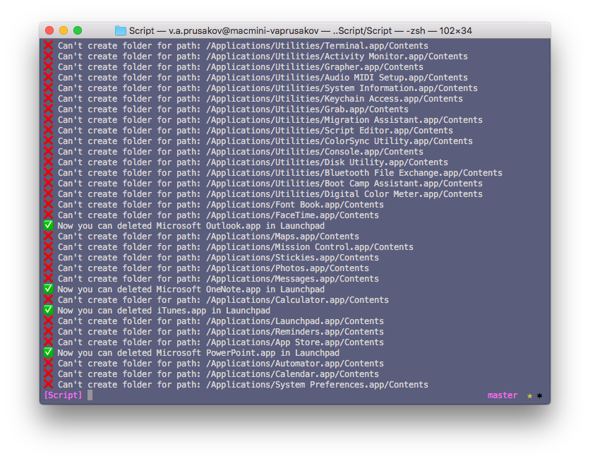

# LaunchpadDeleteAppScript
A small script that allows you to remove applications from the launchpad

### Using script (easy)
Only need execute this command in terminal:
```swift
sudo swift launchpad.swift
```
You should be this output message:




If all it's ok you now could remove application from Launchpad

## References
- [How remove application in Launchpad (rus)](https://geektimes.ru/post/297121/)

## Author

* Vladislav Prusakov [🐦](https://www.twitter.com/spectraldragon_)


